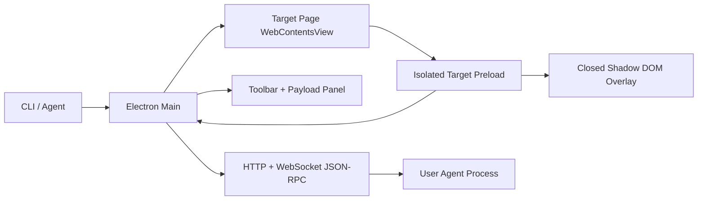

# Agent Debug Browser

[中文说明](./README.zh-CN.md)

Agent Debug Browser is a dedicated Electron browser for reviewing, editing, and annotating pages generated by AI agents. It reuses Chromium instead of building a rendering engine from scratch, injects an isolated target-page preload, renders a closed Shadow DOM overlay, and converts user actions into structured Diff Payloads that an agent can consume immediately.

The goal is simple: when a human points at a page and says “change this”, the agent should know exactly where the target is, what changed, and which visual coordinates were involved.

## Highlights

- **Preview mode**: browse the target page normally without intercepting clicks.
- **Quick Edit mode**: select elements, double-click text to edit it, replace image URLs, drag elements, and adjust common CSS values.
- **Annotation mode**: click any element or region to pin a feedback bubble with spatial coordinates.
- **Agent-ready payloads**: each event contains selectors, XPath, DOM path, source metadata, coordinates, and change details.
- **CLI-first workflow**: agents can launch the GUI, switch modes, read events, or subscribe through WebSocket JSON-RPC.
- **Clean security boundary**: target pages run with `nodeIntegration: false`, `contextIsolation: true`, and `sandbox: true`.

## Requirements

- Node.js 20 or newer
- npm
- macOS or Windows for normal local use

Linux should also work in principle because the app is Electron-based, but the current MVP has only been prepared for macOS and Windows icon/runtime paths.

## Quick Start

Install dependencies:

```bash
npm install
```

Open the demo page:

```bash
node bin/agent-debug-browser.js samples/demo.html --port 17345 --out ./diffs.ndjson
```

Open your own local app:

```bash
node bin/agent-debug-browser.js http://localhost:3000 --port 17345 --out ./diffs.ndjson
```

Open the generated handbook:

```bash
node bin/agent-debug-browser.js docs/agent-debug-browser-guide.html --port 17345 --out ./diffs.ndjson
```

## CLI

Show all commands:

```bash
node bin/agent-debug-browser.js --help
```

Read user interactions:

```bash
node bin/agent-debug-browser.js read --port 17345 --since 0
node bin/agent-debug-browser.js read --port 17345 --format ndjson
```

Inspect the current session:

```bash
node bin/agent-debug-browser.js snapshot --port 17345
```

Switch overlay mode without refreshing the page:

```bash
node bin/agent-debug-browser.js mode preview --port 17345
node bin/agent-debug-browser.js mode quick-edit --port 17345
node bin/agent-debug-browser.js mode annotation --port 17345
```

## Agent API

The RPC server defaults to `http://127.0.0.1:17345`.

| Interface | Endpoint | Purpose |
| --- | --- | --- |
| HTTP | `GET /health` | Liveness check plus session snapshot |
| HTTP | `GET /session` | Current session state, mode, URL, event count, and latency metrics |
| HTTP | `GET /events?since=<sequence>` | JSON event list after a sequence number |
| HTTP | `GET /events.ndjson?since=<sequence>` | NDJSON event export |
| HTTP | `POST /mode` | Change mode with `{"mode":"quick-edit"}` |
| HTTP | `POST /navigate` | Navigate with `{"url":"http://localhost:3000"}` |
| WebSocket | `/rpc` | JSON-RPC 2.0: `events.list`, `session.get`, `mode.set`, `page.navigate` |

See [docs/PROTOCOL.md](./docs/PROTOCOL.md) for payload examples.

## Diff Payloads

Payloads are intentionally redundant so agents can choose the strongest locator for their framework:

- Stable CSS selector from `id`, `data-testid`, ARIA labels, and attributes
- XPath fallback
- DOM path
- Shadow DOM host and inner selector when applicable
- Explicit `data-component`, `data-source-file`, and related source metadata
- React/Vue debug metadata when available
- CDP backend node information through `DOM.getNodeForLocation`
- Viewport, page, and element-relative coordinates
- Concrete `change.before` / `change.after` or annotation text

Current actions include:

- `text.replace`
- `value.replace`
- `image.src.replace`
- `style.update`
- `annotation.create`

## Architecture



More details are in [docs/ARCHITECTURE.md](./docs/ARCHITECTURE.md).

## Development

Run the app with the demo page and DevTools:

```bash
npm run dev
```

Run tests:

```bash
npm test
```

Run syntax checks:

```bash
node --check src/main/main.js
node --check src/main/workbench.js
node --check src/preload/target-preload.js
```

Run the interaction smoke test:

```bash
node bin/agent-debug-browser.js docs/agent-debug-browser-guide.html --port 19274 --remote-debugging-port 19374
npm run smoke:interactions -- --app-port 19274 --cdp-port 19374
```

## Cross-Platform Status

Source-based usage is compatible with macOS and Windows:

- macOS uses `assets/icon.png` at runtime and `assets/icon.icns` for future packaging.
- Windows uses `assets/icon.ico` at runtime and for future packaging.
- Electron downloads the platform-specific Chromium runtime during `npm install`.

The repository does not yet include a production installer configuration. To distribute a double-clickable app, add Electron Builder or Electron Forge and produce macOS `.dmg` / `.zip` plus Windows `.exe` / `.msi` artifacts.

## Project Files

- `bin/agent-debug-browser.js`: CLI entrypoint.
- `src/main/`: Electron main process, workbench layout, CLI parser, session bus, RPC server.
- `src/preload/`: isolated target-page and chrome preload scripts.
- `src/renderer/`: toolbar and payload panel UI.
- `docs/`: architecture, protocol, and visual handbook.
- `samples/`: demo page.
- `test/`: unit tests for CLI, RPC, and session behavior.
- `assets/`: application icons.

## License

MIT
