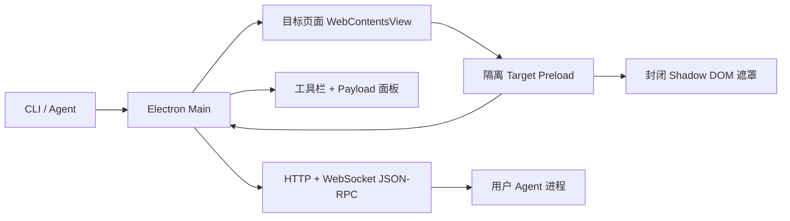

# 灵犀页镜

[English README](./README.md)

灵犀页镜是一款专门用于 Agent 生成页面调试、编辑和批注的 Electron 浏览器。它不从零开发排版引擎，而是复用 Chromium；目标页面通过隔离 preload 注入运行时能力，遮罩层使用封闭 Shadow DOM 渲染，并把用户的编辑、拖拽、批注等操作转换成 Agent 可直接读取的结构化 Diff Payload。

它解决的核心问题很明确：当人类在页面上指出“这里要改”时，Agent 不应该猜“这里”在哪里，而应该立刻拿到目标元素、用户动作、变更内容和空间坐标。

## 核心能力

- **常规预览模式**：像普通浏览器一样浏览目标页面，不拦截点击。
- **快捷编辑模式**：选中元素、双击改文本、替换图片链接、拖拽元素、调整常用 CSS 数值。
- **批注插入模式**：点击任意元素或区域，钉上带空间坐标的反馈气泡。
- **Agent 可读 Payload**：事件包含 CSS selector、XPath、DOM path、源码元数据、空间坐标和具体变更。
- **一键导出给 AI**：即使不是由 AI 程序启动，用户也能在顶部工具栏导出 JSON/NDJSON 交互文件。
- **CLI 优先工作流**：Agent 可以启动 GUI、切换模式、读取事件，也可以通过 WebSocket JSON-RPC 订阅。
- **干净安全边界**：目标页面运行在 `nodeIntegration: false`、`contextIsolation: true`、`sandbox: true` 的环境里。

## 环境要求

- Node.js 20 或更高版本
- npm
- macOS 或 Windows

项目基于 Electron，理论上 Linux 也具备运行基础；但当前 MVP 主要按 macOS 和 Windows 的本地运行与图标路径完成准备。

## 快速开始

安装依赖：

```bash
npm install
```

打开示例页面：

```bash
node bin/intent-browser.js samples/demo.html --port 17345 --out ./diffs.ndjson
```

打开你自己的本地前端应用：

```bash
node bin/intent-browser.js http://localhost:3000 --port 17345 --out ./diffs.ndjson
```

打开项目说明文档：

```bash
node bin/intent-browser.js docs/intent-browser-guide.html --port 17345 --out ./diffs.ndjson
```

窗口打开后，可以直接点击顶部工具栏的 **本地文件** 按钮，从本机选择 `.html`、`.htm` 或 `.xhtml` 文件。软件会自动把文件路径转换成 `file://` 地址并加载，不需要再手动输入本地路径。

如果用户不是通过 AI 程序启动软件，也可以完成编辑或批注后点击顶部工具栏的 **导出给 AI**。软件会保存一个 Agent 可读的 JSON 文件；如果保存为 `.ndjson` 扩展名，则导出逐行事件，适合直接追加到 Agent 的事件消费流程。

右侧 Payload 面板可以从面板标题区或顶部 **侧栏** 按钮隐藏/显示，隐藏后目标页面会立即扩展，不需要刷新。

Windows PowerShell 示例：

```powershell
node .\bin\intent-browser.js .\docs\intent-browser-guide.html --port 17345 --out .\diffs.ndjson
```

## CLI 用法

查看全部命令：

```bash
node bin/intent-browser.js --help
```

读取用户交互：

```bash
node bin/intent-browser.js read --port 17345 --since 0
node bin/intent-browser.js read --port 17345 --format ndjson
```

查看当前会话：

```bash
node bin/intent-browser.js snapshot --port 17345
```

无刷新切换遮罩模式：

```bash
node bin/intent-browser.js mode preview --port 17345
node bin/intent-browser.js mode quick-edit --port 17345
node bin/intent-browser.js mode annotation --port 17345
```

## Agent 接口

RPC 服务默认地址是 `http://127.0.0.1:17345`。

| 接口 | 路径 | 用途 |
| --- | --- | --- |
| HTTP | `GET /health` | 存活检查和会话快照 |
| HTTP | `GET /session` | 当前模式、URL、事件数、切换延迟等状态 |
| HTTP | `GET /events?since=<sequence>` | 按序号读取 JSON 事件 |
| HTTP | `GET /events.ndjson?since=<sequence>` | 读取 NDJSON 事件流 |
| HTTP | `POST /mode` | 用 `{"mode":"quick-edit"}` 切换模式 |
| HTTP | `POST /navigate` | 用 `{"url":"http://localhost:3000"}` 导航页面 |
| WebSocket | `/rpc` | JSON-RPC 2.0：`events.list`、`session.get`、`mode.set`、`page.navigate` |

Payload 示例见 [docs/PROTOCOL.md](./docs/PROTOCOL.md)。

桌面端的 **导出给 AI** 使用同一套事件结构。JSON 文件会包含产品信息、会话快照和完整事件数组；`.ndjson` 文件只输出事件行，方便 Agent 直接流式读取。

## Diff Payload 设计

Payload 会刻意携带冗余定位信息，方便 Agent 针对不同前端框架选择最强定位方式：

- 基于 `id`、`data-testid`、ARIA 和稳定属性生成的 CSS selector
- XPath 回退
- DOM path
- Shadow DOM host 和内部 selector
- 显式 `data-component`、`data-source-file` 等源码元数据
- 可用时读取 React/Vue 调试元数据
- 通过 `DOM.getNodeForLocation` 补充 CDP backend node 信息
- viewport、page、element-relative 坐标
- 明确的 `change.before` / `change.after` 或批注文案

当前支持的动作：

- `text.replace`
- `value.replace`
- `image.src.replace`
- `style.update`
- `annotation.create`

## 架构概览



更多细节见 [docs/ARCHITECTURE.md](./docs/ARCHITECTURE.md)。

## 开发

用示例页面和 DevTools 启动：

```bash
npm run dev
```

运行测试：

```bash
npm test
```

运行语法检查：

```bash
node --check src/main/main.js
node --check src/main/workbench.js
node --check src/preload/target-preload.js
```

运行交互 smoke test：

```bash
node bin/intent-browser.js docs/intent-browser-guide.html --port 19274 --remote-debugging-port 19374
npm run smoke:interactions -- --app-port 19274 --cdp-port 19374
```

## 跨平台状态

源码运行方式已经可以兼容 macOS 和 Windows：

- macOS 运行时使用 `assets/icon.png`，未来打包可使用 `assets/icon.icns`。
- Windows 运行时使用 `assets/icon.ico`，未来打包也可复用它。
- `npm install` 会下载对应平台的 Electron / Chromium 运行时。

当前仓库还没有正式安装包配置。若要面向普通用户分发双击安装包，需要接入 Electron Builder 或 Electron Forge，生成 macOS `.dmg` / `.zip` 和 Windows `.exe` / `.msi`。

## 项目结构

- `bin/intent-browser.js`：CLI 入口。
- `src/main/`：Electron 主进程、工作台布局、CLI 解析、会话总线、RPC 服务。
- `src/preload/`：目标页面和浏览器外壳的隔离 preload。
- `src/renderer/`：工具栏和 Payload 侧栏 UI。
- `docs/`：架构、协议和可视化说明文档。
- `samples/`：示例页面。
- `test/`：CLI、RPC、会话等单元测试。
- `assets/`：应用图标资源。

## 许可证

[MIT](./LICENSE)
