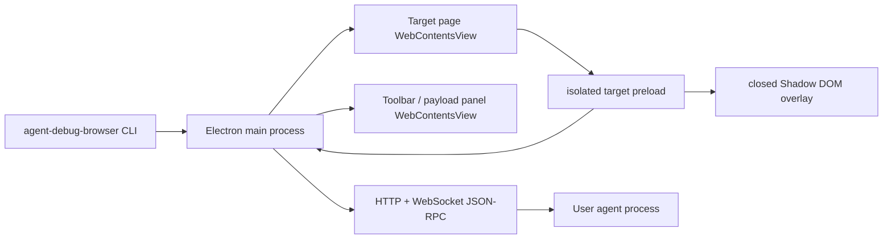

# Architecture

## Process Model

## Why WebContentsView

The MVP uses `BaseWindow + WebContentsView` rather than the `<webview>` tag. It keeps the product close to Electron's current composition API, isolates the target page in its own renderer process, and lets the main process own navigation, CDP enrichment, RPC, and event persistence.

## Mode Switching

Mode switching is an IPC message from main process to the target preload:

1. Toolbar, HTTP, or JSON-RPC calls `mode.set`.
2. Main process updates session state and sends `adb:set-mode` to target WebContents.
3. Target preload toggles local runtime flags and overlay visibility without reloading.
4. Target reports measured apply latency back to main.

The overlay only changes runtime event interception and visual state. It never navigates or recompiles the user's app.

## Locator Strategy

Each diff payload carries redundant locators:

- Preferred CSS selector from stable ids and attributes.
- XPath fallback.
- DOM path with tag/id/class/nth-of-type segments.
- Shadow DOM host + inner selector when applicable.
- Explicit source attributes such as `data-source-file` and `data-component`.
- React private dev fiber `_debugSource` when available.
- Vue component `__file` when available.
- CDP `DOM.getNodeForLocation` output with backend node ids.

The redundancy is intentional: generated apps vary wildly, and the agent should choose the strongest locator available for the framework it controls.

## Clean Edit Semantics

Quick edits mutate the live DOM only as temporary visual feedback. Every mutation captures `before` and `after`, target identity, and user-space coordinates. The browser never compiles code and never attempts to persist source files; reconstruction remains an Agent-side responsibility.
